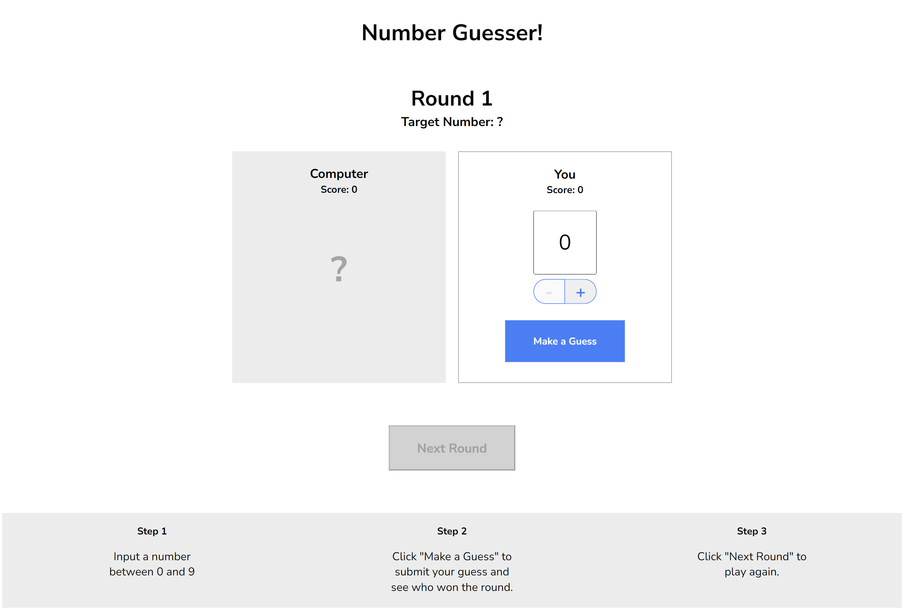

# Number Guesser

A simple number-guessing game between a human player and a computer. The game involves each participant making a guess for a target number between 0 and 9. The winner of each round is determined based on the proximity of the guesses to the target number, and scores are updated accordingly. The game progresses through rounds, with the goal of having the highest score by the end.

This is a challenge project for CodeCademy Full-Stack Engineer course.

## Table of Contents

- [Screenshots](#screenshots)
- [Deployment](#deployment)
- [Usage](#usage)
- [Questions](#questions)

## Screenshots

## Deployment

[Number Guesser](https://zolotavina.github.io/number-guesser/)

## Usage

Click on the [link](https://zolotavina.github.io/number-guesser/) to access Number Guesser game.

## Questions

Open an issue if you have any questions about the repo. You can find more of my work [here](https://github.com/zolotavina).